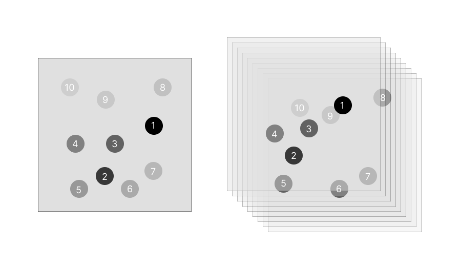
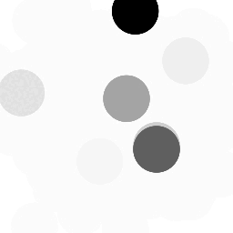
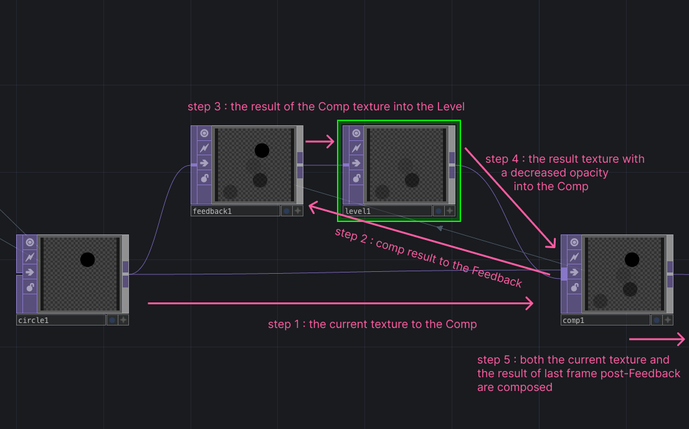
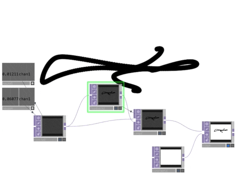
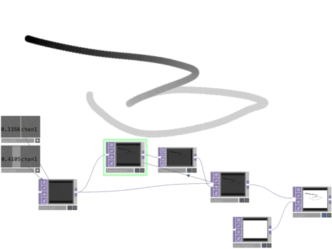
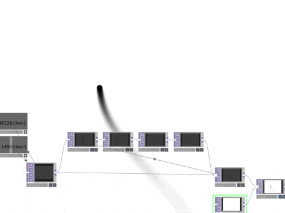
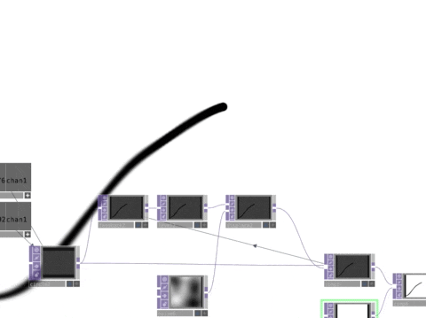

# 🚧🚧🚧 TD_feedback_love 🚧🚧🚧

**Ou comment utiliser le TOP `Feedback` sur TouchDesigner pour faire des dingz.**

## Feedback love ????

<!--Imagine qu'on stack des papiers calques avec chacun un rond à une position différente. Vu que le papier calque est un peu transparent, on voit très bien le rond sur le papier du haut de la pile, un peu moins celui d'en dessous, un peu moins celui d'en dessous, ainsi de suite.

Le texture top vient dans le feedback uniquement pour qu'ils aient la même résolution, le feedback récupère l'image dans le comp, où la texture va donc.

Le level fait en sorte que ça disparaisse slowly : l'opacité de la première frame post feedback est de 0.9 par exemple, puis la frame d'en dessous est 0.9 * 0.9 = 0.81, puis la frame encore en dessous est à 0.9 * 0.9 * 0.9 = 0.72, et ainsi de suite.

-->

Imagine that we are stacking tracing paper, with each a black dot with a different position.
As the tracing paper is quite transparent, we see the dot on the top paper full black, then the dot on the second paper a little bit less, and the one underneath a even less, and so forth.

Now in 12 fps, as if we were adding new pieces of paper.

## Network

The basic feedback loop network : one texture TOP, going to `Composite` TOP and to a `Feedback` TOP looking at the `Composite` TOP, going to a modifier TOP (level, blur, etc), and also in the `Composite`.

The texture TOP goes into the `Feedback` TOP only to get the resolution, as the `Feedback` get the image from the `Composite` TOP.

In the parameters of the `Feedback TOP`, we drag and drop the `Composite TOP` in the Target TOP slot, to have the grey arrow link between the TOPs closing the loop.

In the parameters of the `Level TOP`, in the Post tab, we set the opacity to a lower value like 0.9, to decrease the opacity of the layers as they go through the feedback loop.

The `Level` TOP creates the slowly-disappearing effet : the opacity of the first frame post-Feedback is at 0.9 for example, so the frame underneath is at 0.9 * 0.9 = 0.81, then the one underneath is at 0.9 * 0.9 * 0.9 = 0.72, and so forth.

In the parameters of the `Composite TOP`, we chose a operation mode like Over, Add, or Atop.

## Examples

### The simplest loop ever

The feedback loop only consist of a `Circle` TOP moving randomly with two noises CHOP for x and y, the `Feedback` TOP and the `Composite` TOP, with a white background added after the loop.

The moving circle is therefore continuously drawing a line of its position as it goes through the feedback loop.

To clear the background, we only need to pulse the Reset button in the `Feedback` parameters.

If we add a `Level` after the `Feedback` with an opacity of .99, we can see the line very slowly fading.

### Other operations

If we add a `Blur`, and a `Transform` with -0.01 in Translate Y, we get the effect of a fading, falling, blurring line.

If we add a `Displace` with 0.01 as Displace Weight, and with a slowly animated, large and not really constrasted noise, the fading line keeps slowly moving.

# To go further

- Matthew Ragan's [explaination of the Feedback TOP](https://matthewragan.com/2013/06/16/the-feedback-top-touchdesigner/)

- Video ["What is feedback? feedback in Touchdesigner"](https://www.youtube.com/watch?v=83K3QEK6Iv0) by Noto The Talking Ball

- Video ["feedback TOP TouchDesigner 088"](https://vimeo.com/92110650) by Grady Sain

- Explaination [What is video feedback synthesis](https://andreijaycreativecoding.com/getting_started-with-video-feedback)

<!-- https://alltd.org/feedback-top-in-touchdesigner/ -->
